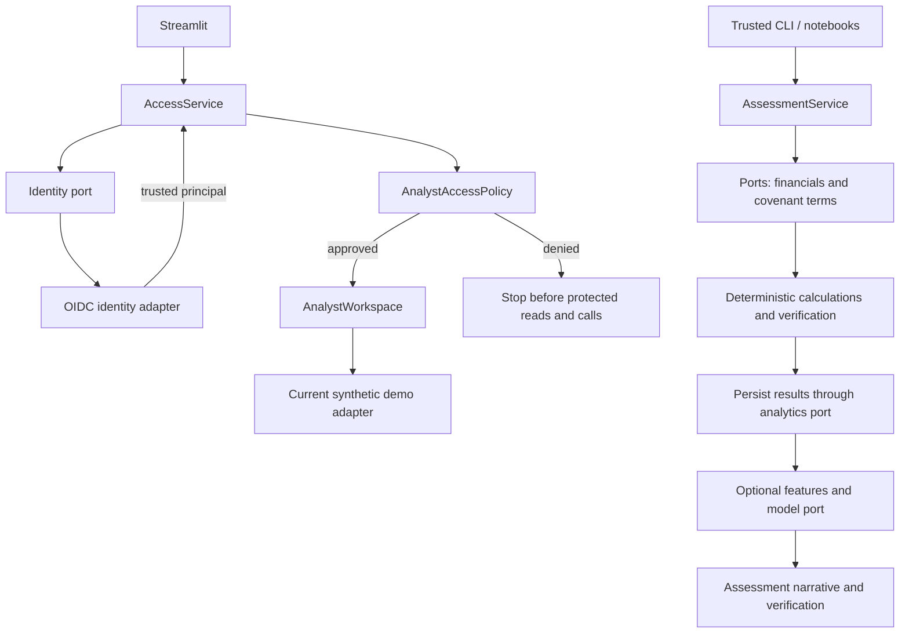

# Architecture proposal and DDD language

Proposed target for this capstone; the [current architecture](architecture.md) remains the implementation record. Decision rationale: [ADR 001](decisions/001-hexagonal-authentication.md).

## Layers and concepts

```text
src/credit_monitoring/
  domain/
    assessment.py, covenant.py, financials.py, evidence.py, ...
    identity.py             # AnalystPrincipal and AnalystAccessPolicy
    financial_metrics.py    # Shared business vocabulary
    calculations/           # Existing deterministic formulas
    covenant_rules.py       # Applicability and calculation rules
    verification/           # Pure structure/provenance/replay checks
    risk_features.py        # Contracts and pure feature rules
  application/
    assessment_service.py, document_processing_service.py, ...
    access_service.py       # require_workspace_access()
    analyst_workspace.py    # Guarded browser-facing operations
    feature_service.py      # Load history, build and persist features
    ports.py                # Identity, financials, terms, analytics, models
  adapters/
    web/                    # Streamlit, identity normalization, session state
    persistence/            # SQLite repositories and row mapping
    documents/              # SEC loading/conversion, extraction, retrieval
    agents/                 # SDK runner, prompts and tool bridges
    ml/                     # Stub/trained model, artifacts and offline training
    demo.py                 # Synthetic benchmark CSV source
  bootstrap.py              # Config, lazy dependency wiring
```

This is the new layout, not an instruction to delete existing directories. Keep original modules as compatibility wrappers during adoption. Root `scripts/`, `notebooks/`, `data/`, and evaluation tooling remain explicit local/offline workflows; tests mirror the layers where useful.

Dependency direction: adapters → application/ports → domain. Adapters may also import domain contracts. Domain has no application, storage, UI or SDK dependencies. Application consumes ports, not concrete repositories or model factories. Bootstrap alone chooses and constructs concrete dependencies; use ordinary constructors and Python `Protocol`, without a dependency-injection framework.

Bootstrap builds access components first; initialize data/SDK dependencies only after approval. New core modules must not import legacy wrappers that lead back to adapters.

Ports expose only consumed methods and typed domain contracts, not SQL rows or entire repository APIs. Retain existing constructor entry points through compatibility wiring during adoption.

| Conceptual context | Responsibility | DDD treatment |
|---|---|---|
| Credit Monitoring — core | Applicable terms, calculations, assessment, optional early warning | `RiskAssessment` groups one run's results; `CovenantResult` identifies a reproducible record. Existing persistence stays unchanged. |
| Document Evidence — supporting | Source provenance and extraction contracts | External extraction/search maps to typed evidence. Preserve explicit agreement/covenant bindings when feeding monitoring. |
| Identity and Access — supporting, new | Recognize an analyst and permit workspace access | Frozen principal value object and access policy. Session/cookie mechanics remain in the web adapter. |

These are conceptual boundaries inside one package. Do not introduce aggregates or event infrastructure without a concrete invariant that needs them.

## Flows



Document flow: catalog → local/downloaded SEC source → Markdown → versioned extraction/cache → typed facts and evidence; search is available independently. Automatic post-extraction verification is currently disabled; structured assessment verification is active. Preserve both facts during migration.

Future live browser wiring must pass through `AnalystWorkspace` before invoking assessment/document/agent services. Authorize in application code before SDK dispatch; model-selected borrower scope is not an access decision. Offline training and evaluation stay separate from runtime assessment.

## Ubiquitous language

| Term | Project meaning / representation |
|---|---|
| Credit Analyst | Human who reviews evidence and remains responsible for credit decisions |
| Borrower | Explicit `borrower_id`; `domain/borrower.py` is an unimplemented placeholder |
| Financial Period | Borrower-quarter metrics and provenance; `FinancialPeriod` |
| Covenant Terms | Source-supported thresholds, basis, schedules and testing events |
| Resolved Covenant | Unique applicable terms for a period, or explicit unresolved issues |
| Covenant Result | Deterministic value/status/headroom with reproducible inputs; `CovenantResult` |
| Assessment Run | One borrower/period/cutoff invocation linked by `assessment_run_id` |
| Information Cutoff | Known availability bound; reporting/load dates do not establish availability |
| Source Evidence | Document identity, citation and quote/provenance; `SourceEvidence` |
| Feature Snapshot / Risk Prediction | Stored model inputs / optional forecast; neither changes observed compliance |
| Analyst Principal — proposed | Immutable trusted `(issuer, subject)` identity; optional display name |
| Workspace Access — proposed | Allowlist approval for the complete capstone analyst workspace |

Missing data remains missing; calculations stay deterministic; narratives never override calculated results. Authentication introduces no ownership relationship between analysts and borrowers.
