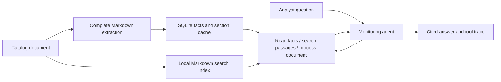

# Complete document processing and the monitoring agent

The application invokes a synchronous service. It reads complete filing Markdown,
extracts supported facts with the existing LLM, stores them in SQLite, and returns
the result. No queue or worker is needed. Analyst questions can independently use
the RAG agent's tools to read facts and retrieve source passages.



## Invoke from application code

```python
from pathlib import Path
from openai import OpenAI
from credit_monitoring.application.document_processing_service import DocumentProcessingService
from credit_monitoring.agents.monitoring import MonitoringAgent

service = DocumentProcessingService(
    client=OpenAI(),
    source_file=Path("data/public_sec_documents.csv"),
    html_dir=Path("data/sec_documents/html"),
    markdown_dir=Path("data/sec_documents/markdown"),
    database_path=Path("data/processed/covenants.sqlite3"),
    user_agent="Your organization contact@example.com",
)

document = service.process_document("DOC_FMC_AMD3_2025")
facts = document.result.extraction
print(document.cache_hit, facts.model_dump())

# State inspection and evidence search do not invoke the model or download files.
documents = service.list_document_extractions(ticker="FMC")
passages = service.search_evidence("interest coverage", ticker="FMC")

agent = MonitoringAgent(client=service.client, service=service)
answer = agent.ask("Show FMC's complete covenant schedules with filing evidence.", ticker="FMC")
print(answer.answer)
print(answer.sources)
print(answer.tool_trace)
```

`notebooks/02-rag.ipynb` demonstrates the direct service and agent loop. Notebook
model cells require API credentials. Existing direct narrative RAG remains available;
the service's evidence search indexes full local Markdown rather than keyword-selected
excerpts. Search returns up to ten ranked passages, at most two per filing. Complete
schedules should be read from stored extraction results rather than inferred from
those few passages.

## Processing and reuse

- Document IDs resolve through the CSV catalog. New catalog entries appear on the
  next service invocation. Only registered documents can be processed.
- Full Markdown is loaded through the existing download/conversion cache. Downloads
  require an identifying SEC User-Agent; source text is never silently truncated.
- The default extraction text budget is 60,000 characters per request, including
  separate heading context. This is a conservative operational setting, not an exact
  model token limit. Set `max_chars` to change it; API context/output failures remain
  explicit and no partial model output is accepted.
- Larger sources split at paragraph boundaries. Tables retain introducing clauses
  and continuation rows separated by page numbers/rules. An indivisible block larger
  than the budget raises `SectionTooLargeError` before extraction begins.
- Section offsets are measured character offsets in the original Markdown. Heading
  context is supplied as a separate record with its own offsets.
- Complete results and successful sections persist in `document_extractions` and
  `document_extraction_sections`. Transactions finish before model calls begin.
- Cache identity includes source text and metadata, model, schema, prompt, conversion,
  segmentation versions, and text budget. Unchanged documents reuse their result;
  changed inputs are stale until processing succeeds again.
- `process_document(id, force=True)` explicitly discards the matching cached run and
  processes it again. A failed forced run does not expose its previous successful
  result as current. Other historical content/configuration versions remain stored.
- Failed section runs retain successful sections for retry. A complete document is
  published only after all sections succeed. Exact duplicate facts are removed;
  distinct versions are retained without legal reconciliation.
- Read methods return `DocumentExtraction` with explicit missing, stale, unavailable,
  processing, failed, or complete state. Only complete/current results contain facts.

Concurrent processing of the same document is not coordinated in this local POC;
invoke the service serially. Ingestion is systematic and independent of an analyst's
question; the agent chooses tools, not which sections ingestion should read.

## Agent behavior

The loop uses the existing Responses client and four allowlisted function tools:
`list_documents`, `get_document_extraction`, `search_evidence`, and `process_document`.
The application validates tool arguments, executes tools sequentially, and supplies
their results back to the model. This follows the
[official OpenAI function-calling flow](https://developers.openai.com/api/docs/guides/function-calling).
No agent framework or additional dependencies are required.

The default permits six tool rounds plus one model response to finish. A further
tool request returns `complete=False`, `error="tool_round_limit"`, and the existing
sources and trace. Model refusals, incomplete responses, empty responses and API
failures also return explicit incomplete outcomes. Expected tool failures return
error results the agent can use to explain missing information.

Ticker scope is enforced by the tool adapters. The agent cannot force reprocessing;
that remains an explicit application action. The trace records requested arguments
and actual tool outcomes, including errors and cache hits. Private model reasoning
is retained only as needed for model continuation and is excluded from public outcomes.
`sources` lists evidence references actually returned by successful tools; it is not
a semantic verification of every claim in the generated answer.

## Verification and limitations

Automatic post-extraction verification is temporarily disabled for the POC. Imports,
calls, and report-building blocks are commented in `covenants/extraction.py`, with
restoration notes. The verifier implementation and standalone tests remain intact.
Restore those imports/calls and replace `validation=None` with the computed reports
to re-enable it; also update the service configuration version to invalidate cached
unverified results.

Result wrappers use schema version `2.1`; `validation: null` means verification did
not run. Callers must handle null rather than dereferencing `validation.is_valid`.
The LLM's V2 fact schema and required evidence are unchanged. Pydantic parsing and
SDK error handling remain active. Prompt versions are now extraction/batch `v2.1`;
the old `v2.0` prompt snapshot is retained alongside the new snapshot.

The agent reports source-supported facts and gaps. Financial calculations, legal
applicability, inferred compliance, automatic post-extraction verification, and
Streamlit integration remain outside this implementation. Mocked tests establish
pipeline behavior, not live LLM completeness or resistance to injected instructions.

Verification on October 5, 2026: all 139 tests passed, Ruff and whitespace checks
passed, and both notebooks passed JSON/Python syntax inspection. All 29 existing
local filings partitioned losslessly into 107 sections with the default budget.
No live model requests were made during implementation or verification.
